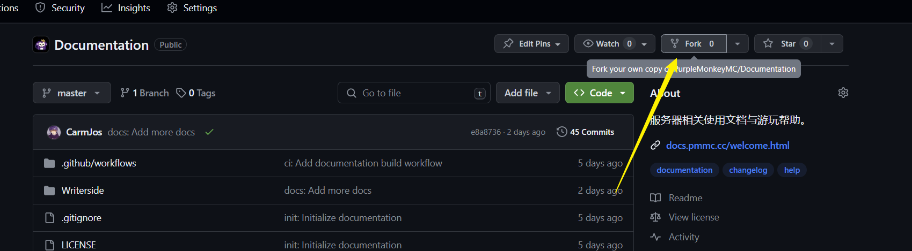
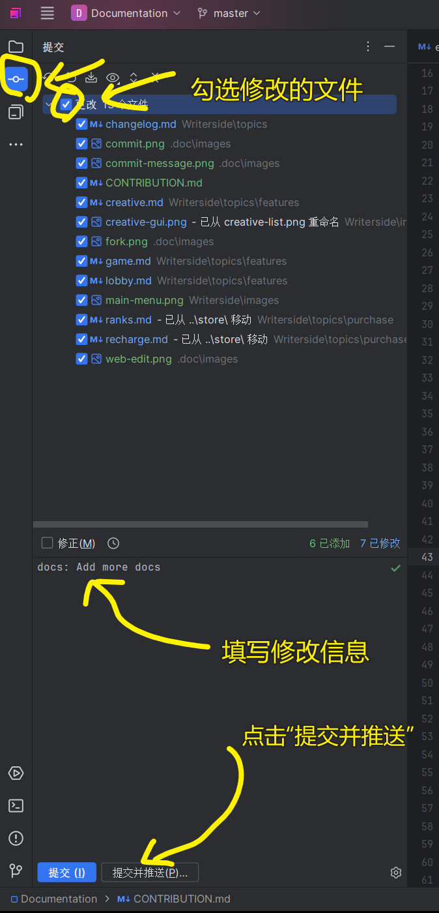
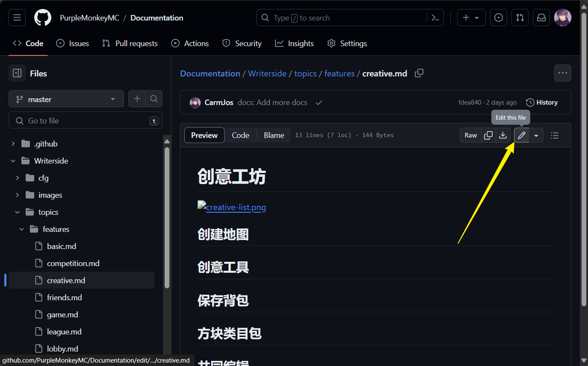
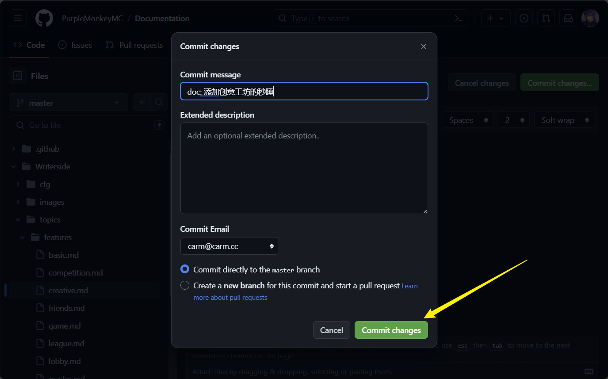

# 为此文档贡献内容

## 1. 注册账号

为了保留您无私贡献的记录，在开始之前，您需要拥有一个 Github 的账号，用于提交您的贡献到本仓库中。

您可以在 [Github - SignIn](https://github.com/signup) 遵循指示注册您的账号。

>（可选）在注册账号后，您可以简单设置您的个人信息，以便让开源社区的其他人了解您！

## 2. FORK此项目

在登录后，点击项目上方的“Fork”，以在您的账户下创建一个此项目的拷贝。

随后，进入您账户下的项目拷贝。

## 3. 开始编辑

此项目的源文件是基于 “[Markdown](https://markdown.com.cn/)” 格式的，这是一种轻量级标记语言，
使用起来非常的简单。您可以参考 [Markdown基本语法](https://markdown.com.cn/basic-syntax/)。

与此同时，项目使用了 Jetbrains 开发的 Writerside 后端，在 Markdown 的基础上额外支持了一些功能，
具体可参考 [Writerside Documentation](https://www.jetbrains.com/help/writerside/semantic-markup-reference.html)。
_（不过一般来说您用不到这些）_

现在您可以编辑项目内容了，您可以选择以下几种编辑方式。

### 3.1 在 Writerside 中编辑 （推荐）

此项目是基于 Jetbrains 开发的 Writerside 搭建的，于是使用 Writerside 软件来编辑是最好的方案。

您可以在 [Download writerside](https://www.jetbrains.com/writerside/download/#section=windows) 下载到
最新版的编辑器软件并安装，随后，您可以在设置中找到 “Plugins”选项，并搜索 “Chinese” 安装中文语言包，重启后您将拥有一个中文版的编辑器。

然后，您需要遵循 [如何在GitHub上克隆项目](https://blog.csdn.net/qq_48271007/article/details/126050656) 中描述的方法，
将您账户下的项目拷贝克隆下来，并使用Writerside打开。

> 这个教程里面的第五步是多余的，不要执行；直接跳过第五步即可。

随后您就可以在 Writerside中编辑此项目了。在软件的左侧，有一个“Writerside”的栏目，此栏目中可以看到对应的内容和演示，以便您进行编辑。

在完成编辑后，您只需要点击左侧“提交”栏目，输入您本次编辑的内容简介，随后点击“提交并推送”；在弹出的推送确认框中再次点击“推送”即可。

### 3.2 在Github网页中编辑

点击网页中的目录 `Writerside/topics` ，在这个目录中存放着所有文档的源文件（包括其中子文件夹内存放的源文件）。

点开任意一个源文件，然后点击文件右上角的 “铅笔” 图标，如图所示：

随后，您可以增添内容；在修改完成后，点击右上角的 “Commit changes...”(提交更新)，
并简单描述本次更新的内容，再点击 “Commit changes” 确认提交即可。

## 4. 提交合并请求

在您完成自己的贡献后，您可以点击 [Pull Request](https://github.com/PurpleMonkeyMC/Documentation/pulls) 界面中点击 “New pull request” 
来新建一个合并请求。

在创建时，选择您自己修改后的项目代码，再点击 “Create pull request” ，填写更新的相关描述，即可提交。

我们将在审核后通过您的请求，您的贡献便会完整的展现在文档之中！

## 5. 致谢

万分感谢您对 PMC 和开源社区的贡献，愿您生活愉快，万事顺利！